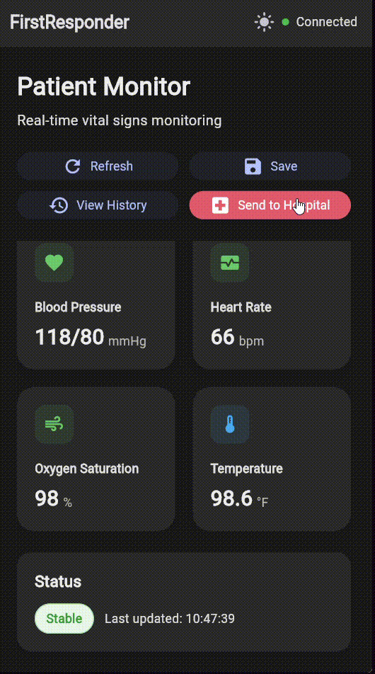

# FirstResponder

A first responder application designed to assist emergency response operations.

## Overview

FirstResponder is a comprehensive application that provides essential tools and interfaces for emergency response scenarios. The application aims to streamline communication and coordination during critical situations.

## Features

- Emergency response interface
- Real-time communication capabilities
- Simulation and testing environment
- User-friendly interface design

## Demo

### User Interface Testing


### Simulation


## Installation

```bash
git clone https://github.com/PranavKrishnaS/FirstResponder.git
cd FirstResponder
```

## Contributing

Contributions are welcome! Please feel free to submit a Pull Request. (The more the merrier.)

## Contact

For questions or support, please contact the repository owner.
